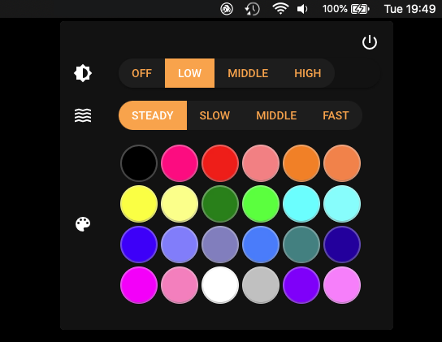

# Sharkoon mouse LED controller for MacOS and Linux systems

LED driver for mouses by Sharkoon and Tracer. Tested with Sharkoon Drakonia / Tracer Recon mouse on
- Ubuntu 16.04
- MacOS Catalina.

# Command line usage

Make sure you have installed `libusb-1.0`. For macOS users `brew install libusb` should do the job.

Compile controller with `make`

	$ ./bin/sharkoonLED -h`

	Usage: ./bin/sharkoonLED [intensity] [pulsation] [color]
		intensity:
			0 - off
			1 - low (default)
			2 - middle
			3 - high
		pulsation:
			0 - steady (default)
			1 - slow
			2 - middle
			3 - fast
		color:
			0 - choose color in program with arrows (default)
			1-24 - color index


# GUI (tray app)
*Tested only on macOS.*



## Build

```sh
# compile controller
make

# open gui directory
cd gui

# build electron app
yarn build
```

Output electron app should be available in `dist/electron/` directory.

## Development
```sh
# compile controller
make

# open gui directory
cd gui

# install dependencies
yarn

# run dev server with auto updates
yarn dev
```
